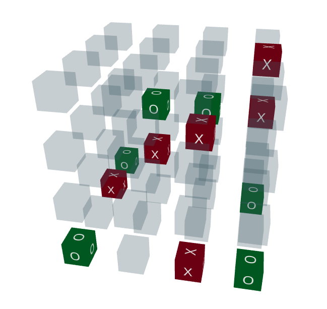

# 3D Tic Tac Toe

An advanced 3D Tic Tac Toe game built with React, TypeScript, and Three.js. Play against a friend or challenge our intelligent AI with three difficulty levels!



## Features

🎮 **Classic 3D Gameplay**
- Play on a 4×4×4 three-dimensional grid
- Win by getting four in a row in any direction (horizontal, vertical, diagonal, or through layers)
- Interactive 3D visualization with rotatable camera view

🤖 **Advanced AI Opponent**
- Three difficulty levels: Easy, Medium, and Hard
- Smart minimax algorithm with alpha-beta pruning for optimal moves
- Natural move timing with realistic thinking delays

🎨 **Immersive 3D Experience**
- Built with React Three Fiber for smooth WebGL rendering
- Color-coded game pieces with visual feedback for winning combinations
- Orbit controls for viewing the board from any angle

⚡ **Modern Tech Stack**
- TypeScript for type safety and better development experience
- React hooks for state management
- Comprehensive test coverage for AI algorithms and game logic
- Responsive design that works on all screen sizes

## Technologies Used

- **React** - Frontend library for building user interfaces
- **TypeScript** - Static typing for JavaScript
- **Three.js** - 3D graphics library
- **React Three Fiber** - React renderer for Three.js
- **React Three Drei** - Useful helpers for React Three Fiber
- **Jest** - Testing framework

## Getting Started

### Prerequisites

- Node.js (v14 or higher recommended)
- npm or yarn

### Installation

```bash
# Clone the repository
git clone <repository-url>

# Navigate to the project directory
cd 3d-tictactoe

# Install dependencies
npm install
```

### Running the Game

```bash
# Start the development server
npm run dev
```

Open [http://localhost:5173](http://localhost:5173) to view the game in your browser.

The page will reload automatically when you make changes to the code.

### Building for Production

```bash
# Build the app for production
npm run build
```

The build artifacts will be stored in the `dist` folder.

### Preview Production Build

```bash
# Preview the production build locally
npm run preview
```

### Running Tests

```bash
# Run all tests
npm test

# Run tests in watch mode
npm test -- --watch
```

## How to Play

### Game Setup

1. Choose your game mode:
   - **Human vs Human**: Play against a friend on the same device
   - **Human vs Computer**: Challenge the AI opponent

2. In Human vs Computer mode, you can:
   - Select which player (X or O) the computer will play as
   - Choose from three difficulty levels:
     - **Easy**: Shallow search depth, makes basic moves
     - **Medium**: Moderate search depth, strategic play
     - **Hard**: Deep search depth, expert-level opponent

### Game Controls

- **Making Moves**: Click on any empty cube to place your mark
- **Viewing the Board**: Drag to rotate the camera, scroll to zoom
- **Reset Game**: Click the "Reset Game" button to start over

### Winning Conditions

Win by placing four of your marks in a row:
- Horizontally (across any layer)
- Vertically (up and down any column)
- Depth-wise (through the layers)
- Diagonally (in any direction including 3D diagonals)

Winning combinations are highlighted with special colors:
- Gold for X winners
- Bright red for O winners

## Technical Architecture

### Core Components

- **Game.tsx**: Main game logic and state management
- **Board.tsx**: 3D board rendering using React Three Fiber
- **Cell.tsx**: Individual 3D cell components with click handlers
- **AIPlayer.tsx**: Dedicated component for computer player logic
- **AI.ts**: Advanced AI algorithms including minimax with alpha-beta pruning

### AI Implementation

The artificial intelligence uses a minimax algorithm with alpha-beta pruning for optimal move selection:

- **Minimax Algorithm**: Evaluates all possible future game states to find the best move
- **Alpha-Beta Pruning**: Optimizes the search by eliminating branches that won't affect the final decision
- **Depth-Limited Search**: Different search depths for each difficulty level:
  - Easy: Depth 1 (basic blocking)
  - Medium: Depth 3 (strategic play)
  - Hard: Depth 5 (expert level)

### Performance Optimizations

- **Memoization**: React.memo for efficient component rendering
- **Event Propagation**: Proper event handling to prevent unnecessary re-renders
- **Frustum Culling**: Disabled for consistent 3D object visibility

## Development

### Project Structure

```
src/
├── components/
│   ├── Game.tsx          # Main game component
│   ├── Board.tsx         # 3D board visualization
│   ├── Cell.tsx          # Individual 3D cells
│   └── AIPlayer.tsx      # AI player logic
├── ai/
│   ├── AI.ts             # AI algorithms and utilities
│   └── AI.test.ts        # AI test suite
├── types/
│   └── types.ts          # TypeScript type definitions
└── styles/
    └── App.css           # Global styles
```

### Available Scripts

In the project directory, you can run:

#### `npm run dev`
Runs the app in development mode with hot reloading on [http://localhost:5173](http://localhost:5173).

#### `npm run build`
Builds the app for production to the `dist` folder.

#### `npm run preview`
Preview the production build locally on [http://localhost:4173](http://localhost:4173).

#### `npm test`
Launches the test runner in interactive watch mode.

## Contributing

Contributions are welcome! Please feel free to submit a Pull Request.

1. Fork the repository
2. Create your feature branch (`git checkout -b feature/AmazingFeature`)
3. Commit your changes (`git commit -m 'Add some amazing feature'`)
4. Push to the branch (`git push origin feature/AmazingFeature`)
5. Open a Pull Request

## License

This project is built with Vite, a fast build tool for modern web projects. It provides lightning-fast HMR (Hot Module Replacement) and optimized production builds.

For more information about Vite, visit the [official documentation](https://vitejs.dev/).
